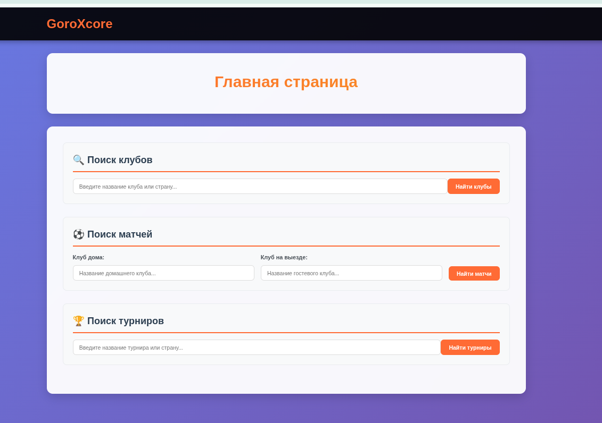
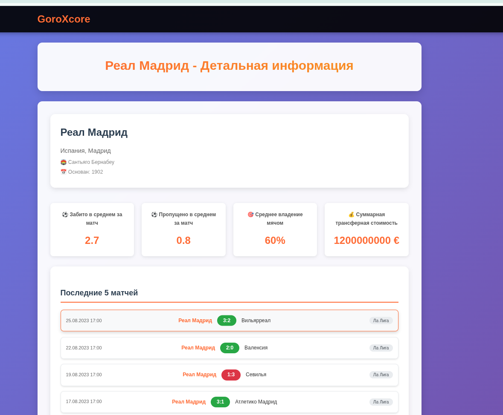
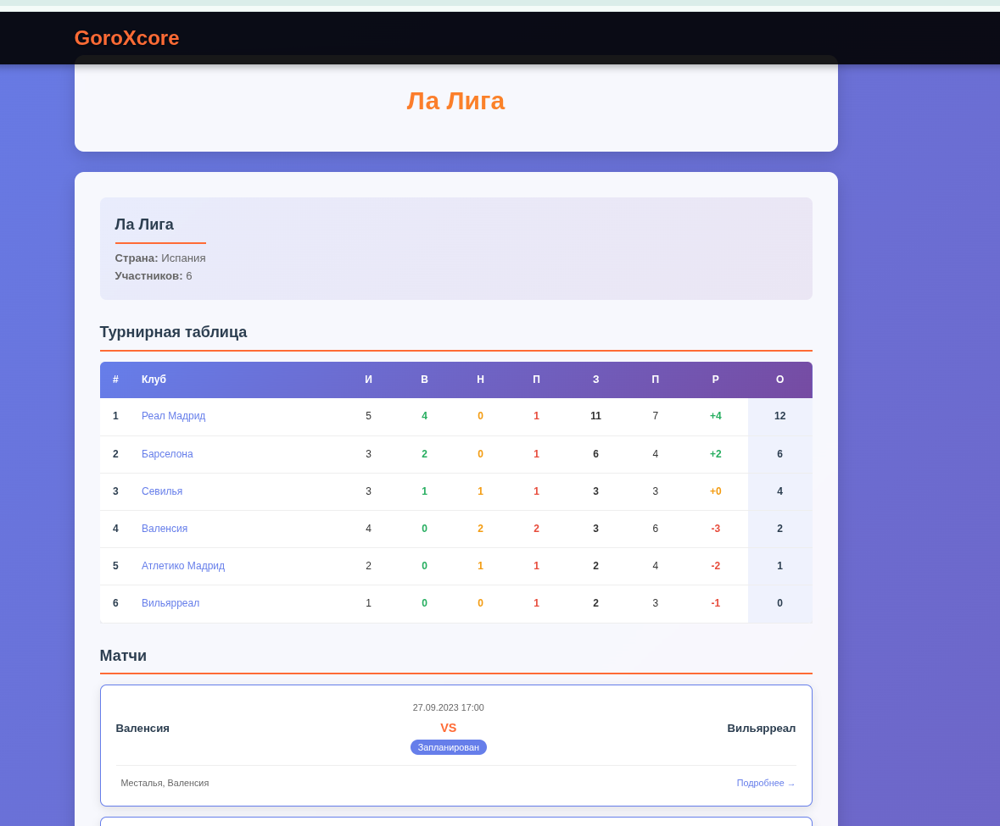
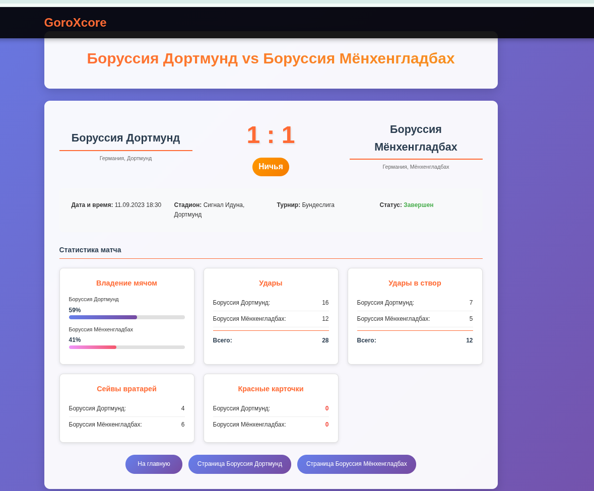

# GoroXcore

GoroXcore — учебный Django-проект о футбольных клубах, турнирах и матчах. Приложение показывает списки, предоставляет поиск и детальные страницы со статистикой.

**Основные возможности**
- Поиск клубов по названию и стране.
- Поиск матчей по домашней и гостевой команде.
- Просмотр турниров и детальная страница турнира с таблицей участников.
- Детальные страницы клубов и матчей со статистикой.

**ПОДСКАЗКИ ДЛЯ ПОИСКА НА САЙТЕ**
Названия в данных приходят **на английском**, поэтому используйте английские варианты.
- **Клубы:** название клуба или страна (например: `Arsenal`, `Spain`).
- **Матчи:** клуб дома и клуб в гостях (например: `Barcelona` — `Real Madrid`).
- **Турниры:** название турнира или страна (например: `Bundesliga`, `France`).

**ДОСТУПНЫЕ ЛИГИ ПО УМОЛЧАНИЮ**

|Premier League |
|La Liga |
|Serie A |
|Bundesliga |
|Ligue 1 |

**Стек**
- Python
- Django 5.2
- SQLite (по умолчанию)
- FastAPI микросервисы в `services/`
- RabbitMQ, PostgreSQL, Docker Compose
- Prometheus + Grafana для метрик

**Структура проекта**
- `GoroXcore/` — настройки проекта Django и корневые `urls.py`.
- `main/` — основное приложение: модели, views, шаблоны.
- `static/` — статические файлы.
- `media/` — загружаемые файлы (эмблемы клубов и логотипы турниров).
- `db.sqlite3` — база данных SQLite.

**Модели данных (кратко)**
- `Club` — клуб с базовой статистикой.
- `Tournament` — турнир/чемпионат.
- `TournamentClub` — связь клуб–турнир с турнирной статистикой.
- `Match` — матч со счетом, датой и расширенной статистикой.

Примечание: для эмблем/логотипов можно хранить URL из API (поля `emblem_url`, `logo_url`),
они используются как fallback, если локального файла нет.

**Основные маршруты**
- `/` — главная страница с поиском клубов, матчей и турниров.
- `/club/<id>/` — детальная страница клуба.
- `/match/<id>/` — детальная страница матча.
- `/tournament/<id>/` — детальная страница турнира и таблица.
- `/admin/` — админка Django.

**Быстрый старт**
```bash
python -m venv venv
source venv/bin/activate
pip install -r requirements.txt
python manage.py migrate
python manage.py runserver
```

**Локальный CI/CD**
В проект добавлен воспроизводимый локальный скрипт:
```bash
./scripts/ci_cd.sh check   # зависимости, Django tests, pytest сервисов, compose config
./scripts/ci_cd.sh deploy  # локальный запуск через Docker Compose
./scripts/ci_cd.sh down    # остановка локального стенда
```

Также доступны `build` и `all`. Скрипт использует `.ci/venv` как локальное окружение и
автоматически выбирает `docker-compose`, если он установлен, иначе пробует `docker compose`.

**Метрики и мониторинг**
Все API отдают Prometheus-метрики:
- Django: `http://localhost:8000/metrics`
- Auth Service: `http://localhost:8003/metrics`
- Ticketing Service: `http://localhost:8001/metrics`
- Payment Service: `http://localhost:8002/metrics`

Минимальный набор метрик:
- `mik_http_requests_total`
- `mik_http_request_duration_seconds`
- `mik_domain_events_total`

После `./scripts/ci_cd.sh deploy` доступны:
- Prometheus: `http://localhost:9090`
- Grafana: `http://localhost:3000` (`admin` / `admin`)

**Импорт данных из football-data.org**
1. Получите API-токен и задайте переменную окружения `FOOTBALL_DATA_TOKEN`.
2. Установите зависимости: `pip install -r requirements.txt`.
3. Запустите импорт:
```bash
python manage.py import_football_data --competitions=PL,PD,SA,BL1,FL1 --season=2023
```

Полезные опции:
- `--clear` — очистить существующие данные перед импортом.
- `--skip-teams`, `--skip-standings`, `--skip-matches` — исключить отдельные блоки.
- `--limit-matches=200` — ограничить количество матчей.

После импорта также пересчитываются показатели клубов по 5 последним матчам
и генерируется суммарная трансферная стоимость (если не пришла из API).

**Авто-обновление данных при запуске сервера**
По умолчанию при `python manage.py runserver` перед стартом сервера выполняется импорт.
Управление через переменные окружения:
- `FOOTBALL_DATA_TOKEN` — обязательный API-токен.
- `FOOTBALL_DATA_COMPETITIONS=PL,PD,SA,BL1,FL1` — список лиг.
- `FOOTBALL_DATA_SEASON=2023` — сезон.
- `FOOTBALL_DATA_CLEAR=1` — очистить данные перед импортом.
- `FOOTBALL_DATA_LIMIT_MATCHES=200` — ограничить количество матчей.
- `SKIP_FOOTBALL_IMPORT=1` — полностью отключить авто-импорт.

**Наполнение тестовыми данными**
В `main/views.py` есть функция `load_tournament_data()`, которая создаёт турниры, клубы и матчи. Она удаляет существующие записи перед загрузкой.

Запуск из Django shell:
```bash
python manage.py shell
```
```python
from main.views import load_tournament_data
load_tournament_data()
```

**Фронтенд и стили**
- Базовые стили и тема находятся в `main/templates/main/layout.html` (цвета, шрифты, фон, карточки).
- Страницы `home/club/match/tournament` имеют свои стили в соответствующих шаблонах:
  `main/templates/main/home.html`, `main/templates/main/club.html`,
  `main/templates/main/match.html`, `main/templates/main/tournament.html`.
- Шрифты подключаются через Google Fonts. При отсутствии сети используются системные fallback‑шрифты.

**Примечания**
- Медиа-файлы сохраняются в `media/`.
- Статические файлы подключаются из `static/`.
- База данных по умолчанию — `db.sqlite3`.


Главная страница - 


Страница клуба - 


Турнирная таблица - 


Статистика матча - 

