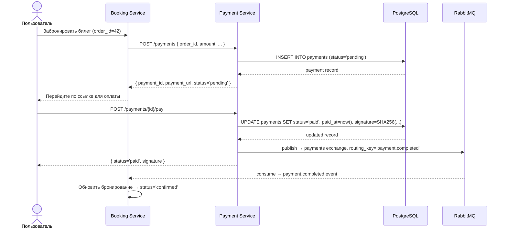
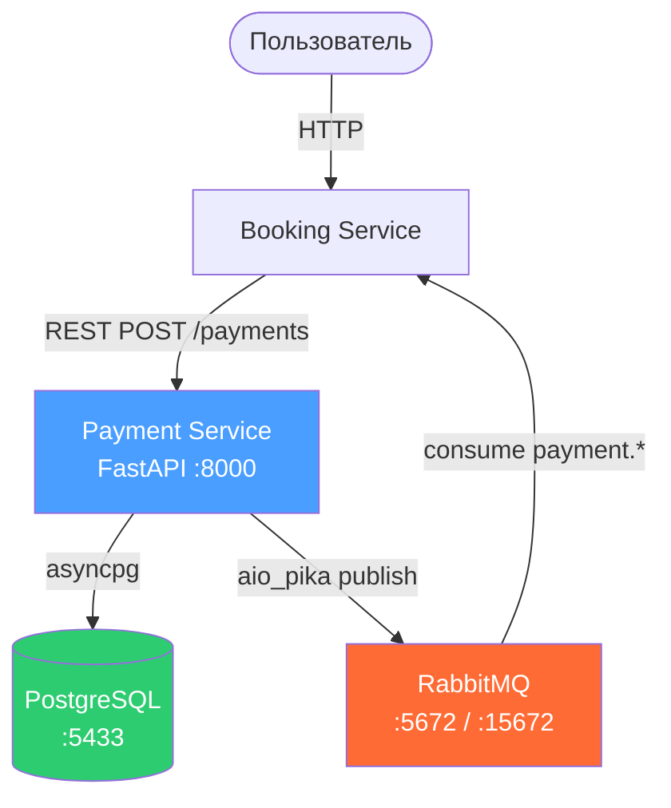
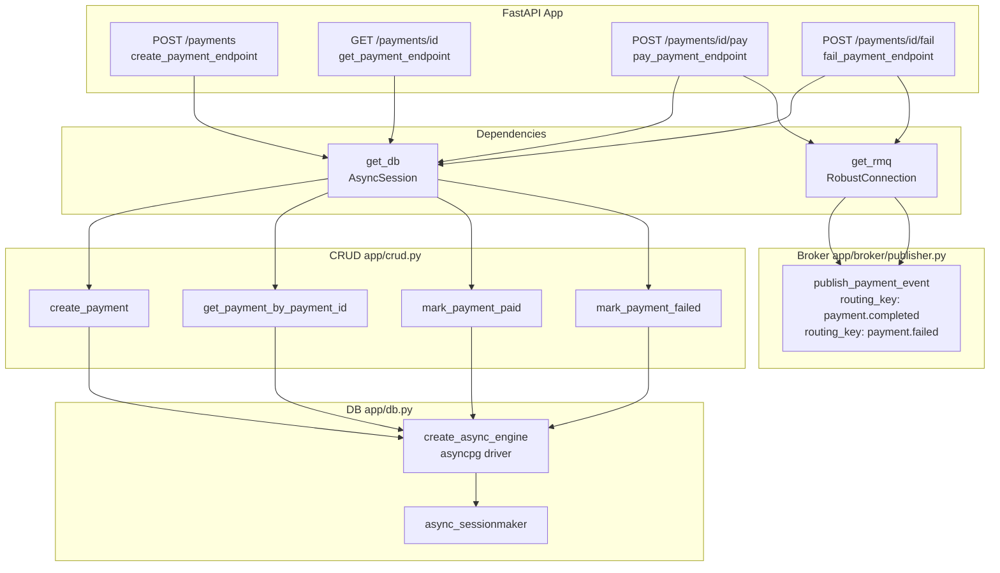
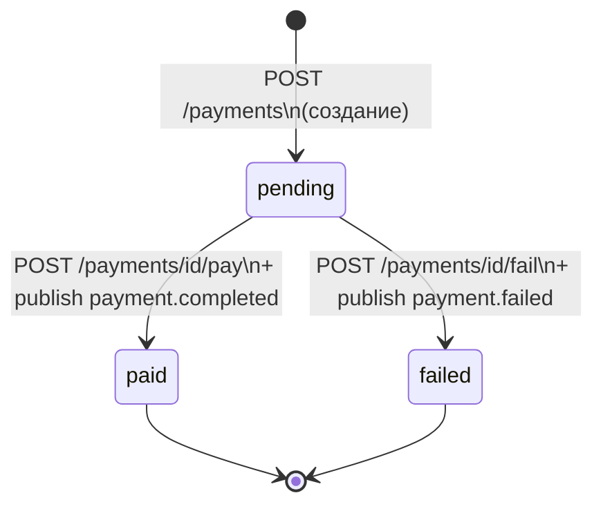
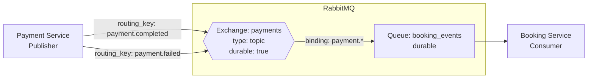
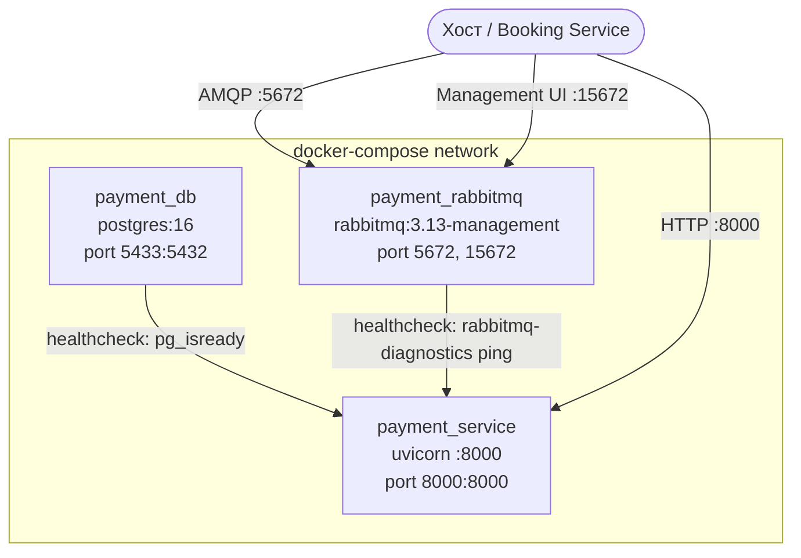

# Payment Service — Архитектурная схема

> Диаграммы написаны в формате Mermaid — GitHub рендерит их автоматически.

---

## 1. Взаимодействие с пользователем (полный сценарий оплаты)



---

## 2. Схема взаимодействия сервисов



---

## 3. Внутренняя структура Payment Service



---

## 4. Схема базы данных

```mermaid
erDiagram
    PAYMENTS {
        int         id              PK  "autoincrement"
        varchar50   payment_id      UK  "pay_xxxxxxxx, indexed"
        int         order_id            "indexed, FK к Booking"
        numeric     amount              "10 precision, 2 scale"
        varchar3    currency            "RUB, USD, ..."
        varchar255  description
        varchar255  customer_email
        varchar500  success_url
        varchar500  fail_url
        varchar500  webhook_url
        varchar20   status              "pending | paid | failed"
        varchar255  signature       NULL "SHA-256, только для paid"
        datetime    paid_at         NULL "только для paid"
        datetime    created_at
        datetime    updated_at
    }
```

### Жизненный цикл статуса



---

## 5. RabbitMQ: потоки сообщений



**Формат сообщения:**
```json
{
  "payment_id": "pay_a1b2c3d4",
  "order_id": 42,
  "status": "paid",
  "amount": 1500.00,
  "currency": "RUB",
  "paid_at": "2026-04-25T12:00:00Z",
  "signature": "<sha256>"
}
```

---

## 6. Docker — схема сети контейнеров



**Порядок старта:**
1. `payment_db` — ждёт `pg_isready`
2. `payment_rabbitmq` — ждёт `rabbitmq-diagnostics ping`
3. `payment_service` — стартует только когда оба healthy → запускает `alembic upgrade head` → запускает `uvicorn`

---

## 7. Async: как работает event loop

```
Запрос 1: POST /pay  ──►  await db.execute()  ──► (ждёт БД, event loop свободен)
                                                         │
Запрос 2: GET /health ──────────────────────────────────┘  обрабатывается параллельно
                                                         │
Запрос 1: ◄────────────────────────────────── db вернул ответ, продолжаем
          await publish_payment_event()  ──►  (ждёт RabbitMQ, event loop свободен)
```

Ключевой принцип: `await` не блокирует поток. Пока один запрос ждёт ответа от БД или RabbitMQ, event loop переключается на другие запросы. Один процесс обрабатывает тысячи соединений.
